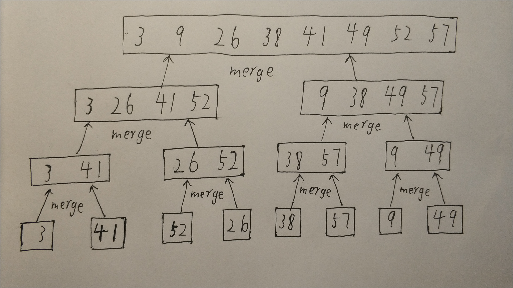
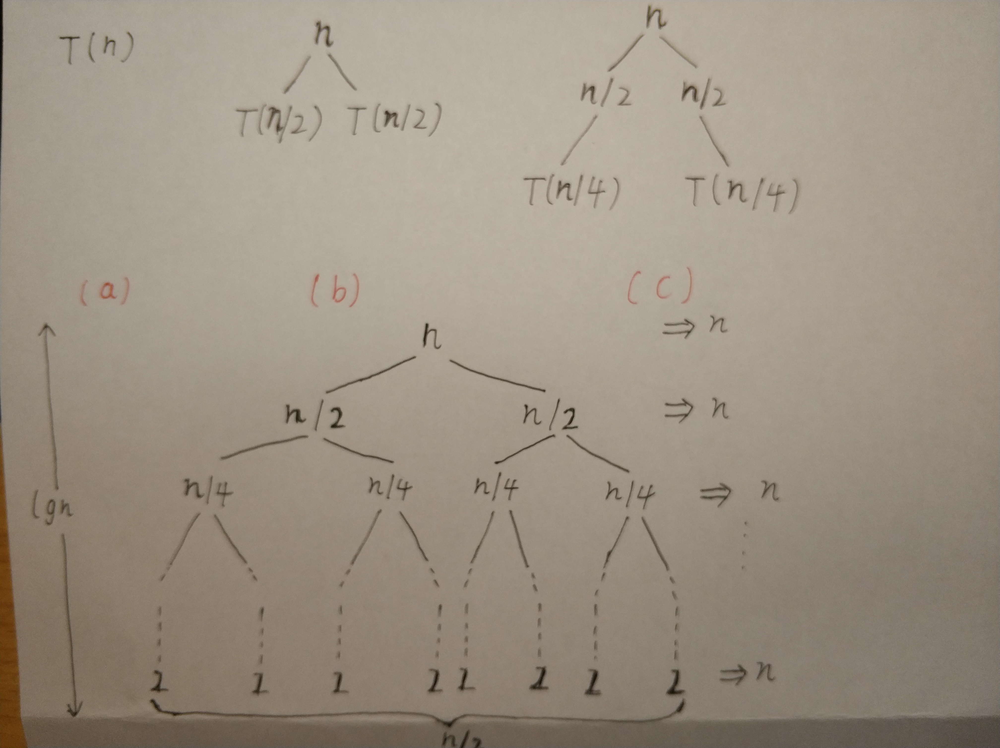

## 2.3-1

## 2.3-2
见本章的代码实现<br/>
## 2.3-3
n为2的幂，那么说明这是一个左右均对称的二叉树。归并排序在最顶层并不解决子问题，所以最顶层只有合并和分解的时间消耗。那么T(n)=2T(n/2)+n,对应的递归树就是一个根节点为n，左右子树都为T(n/2)的二叉树。如此往下继续，最终子问题达到终止状态，即问题规模为2，那么此时的每个叶节点都应为2，叶节点数目则应有n/2个。<br/>
如图所示：<br/>

此时，该树的一共有lgn层(这里由于是到n=2，所以要比完全分解少一层)，每层贡献代价n。所以总代价就为nlgn。<br/>
PS:一开始我这里迷了，因为书上第一个式子是c，第二个式子是2T(n/2)+cn，但其实这里的两个c没有任何关系。
上面的一个c只是为了表示常数量，上面可以是任何数，只要是一个常量。下面的cn代表的是n项合拼和分解的总时间。**书上的每一句写上去都是有用的，要认真阅读！**。<br/>

## 2.3-4
当n=1时，T(n)=1<br/>
当n>1时，T(n)=T(n-1)+T(1)+n<br/>
## 2.3-5
```
BINARY-SEARCH(A,start,end,v)
mid=(start+end)/2   //向下取整
while start <= end
    if v = A[mid]
        return mid
    else if v < A[mid]
        BINARY-SEARCH(A,start,mid-1)
    else if v > A[mid]
        BINARY-SEARCH(A,mid+1,end)
return NIL
```
**递归式：**
由于是查找，所以这里只有分解的代价，而且由于每次只查找一半，所以每次只用计算一边的代价。<br/>
当n=1时，T(n)=1;<br/>
当n>1时，T(n)=T(n/2) + 1<br/>
由于每一层只用计算一个节点的代价，所以每一层的代价都为1，一共有lgn+1层，所以总代价为lgn+1,忽略常数项变得出O(lgn)。<br/>
## 2.3-6
显然不行，因为这里既使是使用了二分查找也只是减少了查找的次数，然而当你找到某个元素小于等于它后一个元素大于它时，你仍然需要把大于它的元素都向后移一位，这个操作需要O(n)的时间复杂度。<br/>
## *2.3-7
```
TWO-SUM-SEARCH(S,x)
A = MERGE-SORT(S)
for k = 1 to S.length
	v = x-A[k]
if BINARY-SEARCH(A,1,A.length,v) ≠ NIL
	return true
return false

```
首先，对数组S进行排序。<br/>
然后，从1开始依次访问A的元素，设v=x - A[ k ]，利用二分查找，如果数组中存在和A[ k ]相加等于x的元素，如果存在二分查找会返回这个元素的下标，如果不存在，则会返回一个NIL。<br/>
**时间复杂度**<br/>
O(nlgn)+O(lgn)+O(1)=O(nlgn)<br/>


